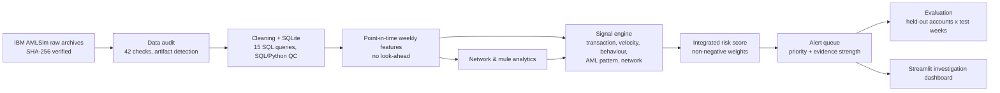
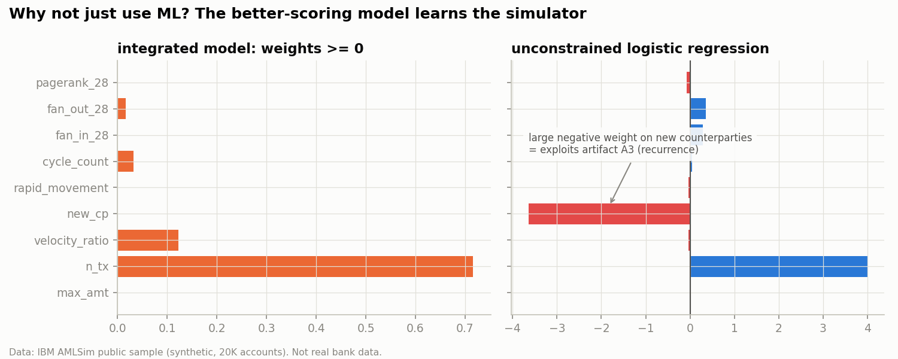
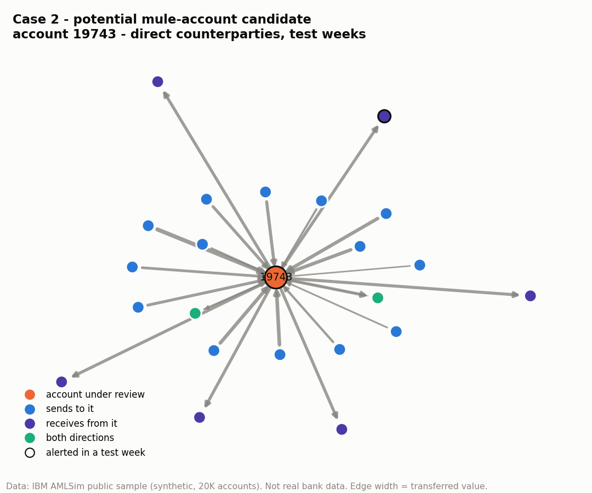

# AML-Intelligence-Engine-Explainable-Risk-Network-Analytics

**An Explainable Transaction Intelligence Framework for Banking Risk, Financial Crime Monitoring, and Alert Prioritization**

> I built an explainable transaction-monitoring analytics framework that combines behavioural, transactional and
> network signals to prioritise potential AML-typology and mule-account activity for investigation - and measured,
> on held-out accounts and later weeks, where that complexity helps and where it does not.

| | |
| **What** | Weekly, point-in-time monitoring of 120,558 synthetic transfers between 20,000 accounts: 12 documented rules, an explainable integrated risk score, a prioritised alert queue with ranked evidence, network/mule analytics, and a Streamlit investigation dashboard. |
| **Why** | Banks must find the few accounts worth investigating without drowning analysts in alerts. In India, card/internet frauds were 56% of 2024-25 bank fraud cases but 1.4% of value (RBI) - many small, fast cases. |
| **Data** | Official IBM AMLSim sample (Apache-2.0): sender, receiver, amount, day step, AML-typology label. No payment-fraud label exists, so no supervised fraud detection is claimed. |
| **Method** | SQL + Python pipeline → data audit → point-in-time features → label-free rule thresholds → non-negative logistic risk score → priority tiers → evaluation on a held-out half of accounts in later weeks, with leakage checks and robustness tests. |
| **Result** | 215 alerts at 86.5% precision vs 807 at 40.6% for an amount+velocity rule (73% fewer alerts; recall 14.1% vs 24.4%). For ranking, the integrated score is only marginally better (PR-AUC 0.457 vs 0.445). |
| **Business value** | Quantifies the detection ↔ workload trade-off, shows which signals are worth their alerts, and gives investigators "why flagged" evidence per account. |
| **Limitations** | Synthetic data with generator artifacts; account-level typology labels; unrealistic 9.0% prevalence; no timestamps, types, KYC or losses. |

## Architecture



Analyst workflow simulated end to end: **transaction → signal → alert → evidence → account context → network context → priority → analyst review → decision**.

## Key findings (held-out accounts, test weeks 13-21, base rate 9.2%)

| Approach | Alerts | Alert precision | Account recall | False-positive accounts | PR-AUC |
|---|---:|---:|---:|---:|---:|
| B1 Large-amount rule | 488 | 11.5% | 5.4% | 305 | 0.111 |
| B2 Amount + velocity | 807 | 40.6% | 24.4% | 336 | 0.445 |
| B5a ≥ 2 signal families | 316 | 75.0% | 16.8% | 59 | 0.366 |
| **B5b Integrated risk score** | **215** | **86.5%** | **14.1%** | **20** | **0.457** |
| ML1 unconstrained logistic (not deployable) | 709 | 98.4% | 58.4% | 11 | 0.713 |

1. **A large-amount rule barely beats random** - typology transfers are *smaller* than normal ones.
2. **At equal workload the integrated score wins on both axes:** its 97th-percentile cut-off raises 723 alerts at 66.1% precision / 39.2% recall vs 807 at 40.6% / 24.4% for amount+velocity.
3. **Velocity carries most of the transferable signal.** The integrated score cuts alerts by 73% at higher precision, but its ranking gain over velocity is statistically real and practically negligible (ΔPR-AUC 0.012, 95% CI 0.004-0.020).
4. **The best-scoring model learned the simulator.** Three generator artifacts were found (e.g. background accounts almost never pay the same counterparty twice). An unconstrained model exploits this with a -3.65 weight on *new counterparties* - it would flag everyone who pays rent. The non-negative score cannot.
5. **Unusual ≠ suspicious.** An unlabelled hub (Case 4) triggers every rule; mule candidates with *collection + forwarding* evidence are far more specific than fan-in alone.
6. **At 1% prevalence**, the integrated score's precision would fall to about 37% - the class-imbalance reality of AML.

Full detail: [findings](reports/findings.md) · [final report](reports/final_report.md) · [case studies](reports/case_studies.md) · [methodology](reports/methodology.md) · [data audit](reports/data_audit.md) · [leakage audit](reports/leakage_audit.md)

<p align="center">




</p>

## Dashboard

`streamlit run dashboard/app.py` opens an 8-page investigation app: executive overview · alert queue (filter,
set workflow status) · **account investigation** (why flagged, behaviour vs own baseline, transactions, 2-hop network)
· AML monitoring · mule accounts & network drill-down · labelled-activity analytics · rule & model performance ·
data & limitations.

**Status - honest note:** Streamlit could not be installed in the environment this project was built in (PyPI was
blocked), so the app has **not** been launched and no screenshots are included. Every page was executed end to end
against a stub of the Streamlit API (`python tests/smoke_test_dashboard.py`), which exercises all data queries,
tables and figures, but does not prove the real UI renders. Please run it locally and add screenshots.

## How to run

```bash
git clone <your-repo-url> aml-fraud-mule-account-analytics
cd aml-fraud-mule-account-analytics
python -m venv .venv && source .venv/bin/activate      # Windows: .venv\Scripts\activate
pip install -r requirements.txt
python run_pipeline.py                 # ~2-3 min: audit, features, scoring, evaluation, figures, SQL, reports
python tools/execute_notebooks.py      # executes the 10 notebooks in place (or: jupyter nbconvert --execute)
python tests/run_tests.py              # validation suite
streamlit run dashboard/app.py         # investigation dashboard
```

The raw data (3.8 MB, Apache-2.0) is committed in `data/raw/amlsim_sample/`; `scripts/download_data.sh` re-fetches it
from IBM's repository and verifies the checksums. `data/processed/` is rebuilt by the pipeline and is git-ignored.

## Repository

```
data/raw/amlsim_sample/     unmodified IBM AMLSim archives + SHA256SUMS + license
src/                        pipeline modules (ingestion ... evaluation, leakage audit, reporting)
sql/analytical_queries.sql  15 analytical queries (CTEs, joins, window functions, ranking)
notebooks/                  01 audit ... 10 robustness (executed)
dashboard/                  Streamlit app + data-access layer
outputs/tables|figures|models   every number and chart in the reports
reports/                    data audit, leakage audit, methodology, findings, case studies, final report
tests/                      validation suite + dashboard smoke test
tools/                      notebook builder / executor
docs_templates/, reports/templates/   report templates (numbers are filled from outputs)
```

## Technology

Python 3.11 · pandas · NumPy · SciPy · scikit-learn · NetworkX · Matplotlib · SQLite · Streamlit.
No SHAP or deep learning: explanations are exact linear contributions of a monotone score.

## Ethics and disclaimer

Suspicious does not mean criminal; an anomaly is not fraud; a mule-risk candidate is not a confirmed mule; an AML
signal does not establish money laundering. Automated scores should support, never replace, human investigation.
The data are synthetic and represent no real customer or bank. This is an educational analytics project: it is not
an RBI-compliant or production AML system and provides no legal, regulatory or financial advice.
