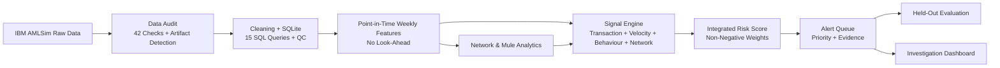
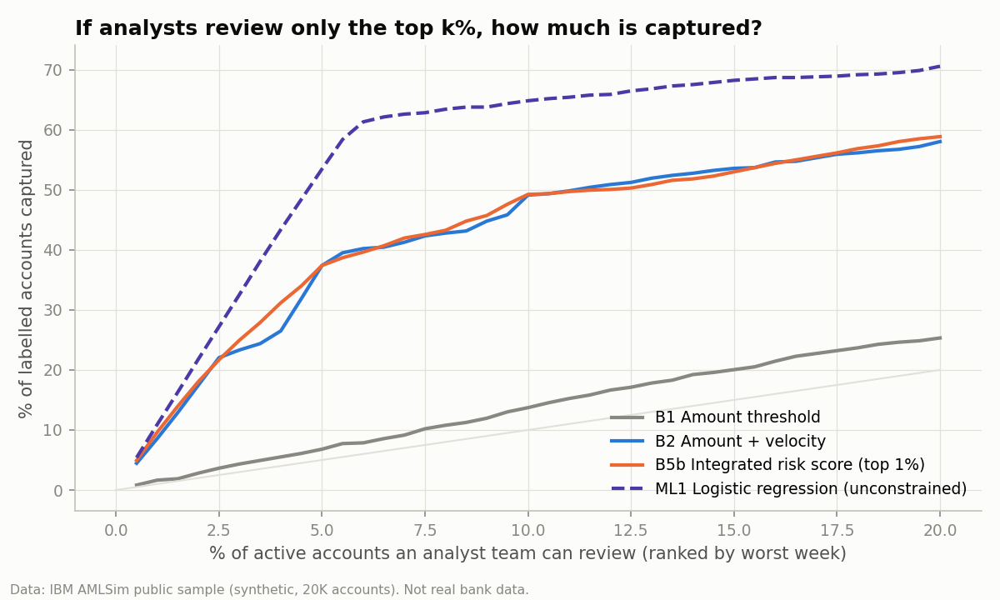

# AML-Intelligence-Engine-Explainable-Risk-Network-Analytics

### An Explainable Transaction Intelligence Framework for Banking Risk, Financial Crime Monitoring, and Alert Prioritization

I built an explainable transaction-monitoring framework that combines **behavioural, transactional, and network signals** to prioritise potential AML-typology and mule-account activity for investigation, while measuring where additional modelling complexity improves detection and where it does not.

|                    |                                                                                                                                                                                                                                              |
| ------------------ | -------------------------------------------------------------------------------------------------------------------------------------------------------------------------------------------------------------------------------------------- |
| **What**           | Weekly, point-in-time monitoring of **120,558 synthetic transfers across 20,000 accounts**, using 12 documented rules, an integrated risk score, a prioritised alert queue, network/mule analytics, and a Streamlit investigation dashboard. |
| **Why**            | AML monitoring must identify the accounts worth investigating without overwhelming analysts with low-quality alerts.                                                                                                                         |
| **Data**           | IBM AMLSim synthetic transaction data: sender, receiver, amount, day step, and AML-typology labels. No payment-fraud label exists, so no supervised fraud-detection claim is made.                                                           |
| **Method**         | SQL + Python pipeline → data audit → point-in-time features → rule thresholds → non-negative logistic risk score → priority tiers → held-out evaluation → leakage and robustness checks.                                                     |
| **Result**         | **215 alerts at 86.5% precision** vs **807 at 40.6%** for an amount + velocity rule — **73% fewer alerts** with higher precision.                                                                                                            |
| **Business value** | Quantifies the detection–workload trade-off and provides investigators with **“why flagged” evidence** for each account.                                                                                                                     |
| **Limitations**    | Synthetic data, generator artefacts, account-level typology labels, unrealistic prevalence, and no KYC, payment-type, timestamp, or loss information.                                                                                        |

---

## Architecture



**Analyst workflow:**
**Transaction → Signal → Alert → Evidence → Account Context → Network Context → Priority → Analyst Review → Decision**

---

## Key Findings

Evaluation was performed on **held-out accounts during test weeks 13–21**, with a base rate of approximately **9.2%**.

| Approach                  |  Alerts | Alert Precision | Account Recall | False-Positive Accounts |    PR-AUC |
| ------------------------- | ------: | --------------: | -------------: | ----------------------: | --------: |
| Large-amount rule         |     488 |           11.5% |           5.4% |                     305 |     0.111 |
| Amount + velocity         |     807 |           40.6% |          24.4% |                     336 |     0.445 |
| ≥ 2 signal families       |     316 |           75.0% |          16.8% |                      59 |     0.366 |
| **Integrated risk score** | **215** |       **86.5%** |      **14.1%** |                  **20** | **0.457** |
| Unconstrained logistic*   |     709 |           98.4% |          58.4% |                      11 |     0.713 |

*Diagnostic comparison only; not treated as deployable.

### What the results show

1. **Large amount alone is weak.** Typology transfers are smaller than normal transfers in this simulated dataset.
2. **The integrated score reduces workload.** It produces **73% fewer alerts** than the amount + velocity baseline while achieving much higher precision.
3. **Velocity carries most of the transferable signal.** The integrated score improves PR-AUC only marginally over velocity (**0.457 vs 0.445**).
4. **Unconstrained ML can learn simulator artefacts.** The unconstrained model exploited generator-specific behaviour that would not necessarily generalise to real banking data.
5. **Unusual does not mean suspicious.** Network connectivity alone is insufficient; collection + forwarding patterns provide more specific mule-risk evidence.
6. **Class imbalance matters.** At a 1% prevalence, estimated precision falls to approximately **37%**.

---

## Detection vs Workload

The project evaluates detection performance together with the **investigator workload required to achieve it**.

<p align="center">
  
  
</p>

---


## Dashboard

The project includes an **8-page Streamlit investigation application**:

**Executive Overview → Alert Queue → Account Investigation → AML Monitoring → Mule & Network Analysis → Labelled Activity Analytics → Rule & Model Performance → Data & Limitations**

The account investigation workflow includes:

* Why the account was flagged
* Behaviour relative to its own baseline
* Transaction history
* 2-hop network context
* Risk evidence

> **Dashboard status:** Streamlit could not be installed in the original build environment, so the real UI has not been launched or visually validated. All dashboard pages were executed against a Streamlit API stub using `python tests/smoke_test_dashboard.py`.

---

## How to Run

```bash
git clone <your-repo-url> aml-intelligence-engine
cd aml-intelligence-engine

python -m venv .venv
source .venv/bin/activate       # Windows: .venv\Scripts\activate

pip install -r requirements.txt

python run_pipeline.py
python tools/execute_notebooks.py
python tests/run_tests.py

streamlit run dashboard/app.py
```

The main pipeline performs the **data audit, feature engineering, scoring, evaluation, SQL analysis, figure generation, and report generation**.

---

## Repository Structure

```text
aml-intelligence-engine/
│
├── data/
│   ├── raw/amlsim_sample/
│   └── processed/
├── src/
├── sql/
│   └── analytical_queries.sql
├── notebooks/
├── dashboard/
├── outputs/
│   ├── tables/
│   ├── figures/
│   └── models/
├── reports/
├── tests/
├── tools/
├── run_pipeline.py
└── requirements.txt
```

---

## Technology

**Python 3.11 · Pandas · NumPy · SciPy · Scikit-learn · NetworkX · Matplotlib · SQLite · Streamlit**

Explanations are derived directly from the **linear contributions of the monotone risk score**; no SHAP or deep learning is used.

---

## Limitations & Disclaimer

* The data are synthetic and contain generator-specific artefacts.
* AML typology labels are account/activity-level labels.
* The simulated prevalence is substantially higher than many real-world AML settings.
* The dataset contains no KYC information, payment types, timestamps, or financial-loss labels.
* Suspicious activity does not establish fraud or criminal behaviour.
* A mule-risk candidate is not a confirmed mule account.
* This is an educational analytics project, **not a production or RBI-compliant AML system**.
