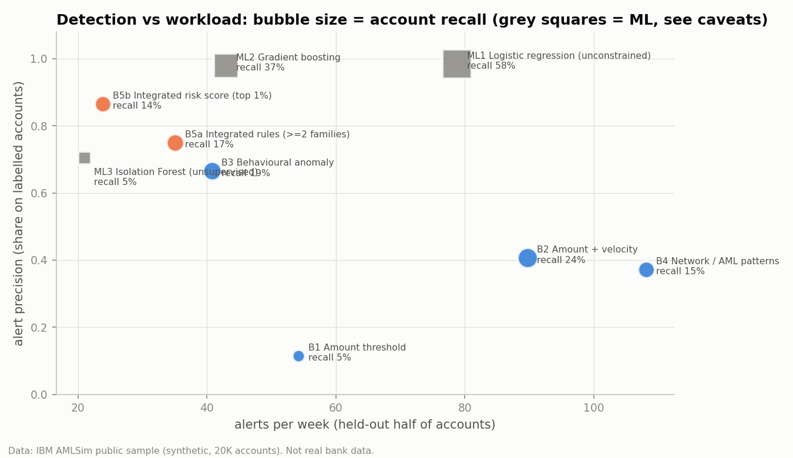

# AML-Intelligence-Engine-Explainable-Risk-Network-Analytics
### Can explainable transaction signals identify high-risk accounts without overwhelming investigators?

An end-to-end transaction-monitoring framework combining **behavioural, transactional, rule-based, and network signals** to prioritise potential AML activity and provide investigators with evidence explaining why an account was flagged.

---

## Problem

Banks need to identify suspicious accounts while controlling the number of alerts sent to investigators.

This project asks:

* Can multiple signals outperform simple transaction rules?
* Can alert volume be reduced without losing useful detections?
* Which signals provide transferable AML risk information?
* Can risk scores remain explainable?
* Can network behaviour help identify potential mule accounts?

---

## Data

|                  |                       |
| ---------------- | --------------------- |
| **Dataset**      | IBM AMLSim            |
| **Transactions** | 120,558               |
| **Accounts**     | 20,000                |
| **Monitoring**   | Weekly, point-in-time |
| **Data type**    | Synthetic             |
| **Labels**       | AML typology activity |

> AMLSim does not provide a payment-fraud label, so this project does **not** claim supervised fraud detection.

---

## Architecture

```text
Transactions
     ↓
Data Audit & Cleaning
     ↓
Point-in-Time Features
     ↓
Behavioural + Transactional + Network Signals
     ↓
Explainable Rules
     ↓
Integrated Risk Score
     ↓
Alert Prioritisation
     ↓
Held-Out Evaluation
     ↓
Network / Mule Analysis
     ↓
Investigation Dashboard
```

---

## Approach

| Component                | What was done                                                 |
| ------------------------ | ------------------------------------------------------------- |
| **Data audit**           | Quality checks, distributions and generator artefact analysis |
| **Feature engineering**  | Point-in-time behavioural and transaction signals             |
| **Rule engine**          | 12 documented AML-oriented rules                              |
| **Risk scoring**         | Non-negative logistic integrated score                        |
| **Alert prioritisation** | Risk tiers and ranked alert queue                             |
| **Evaluation**           | Precision, recall, PR-AUC and workload analysis               |
| **Robustness**           | Held-out accounts, later weeks and leakage checks             |
| **Network analysis**     | Counterparty relationships and mule-account patterns          |
| **Dashboard**            | Streamlit investigation workflow                              |

---

## Key Results

**Held-out accounts, test weeks 13–21, base rate 9.2%:**

| Approach                  |  Alerts | Precision |    Recall |    PR-AUC |
| ------------------------- | ------: | --------: | --------: | --------: |
| Large-amount rule         |     488 |     11.5% |      5.4% |     0.111 |
| Amount + velocity         |     807 |     40.6% |     24.4% |     0.445 |
| ≥ 2 signal families       |     316 |     75.0% |     16.8% |     0.366 |
| **Integrated risk score** | **215** | **86.5%** | **14.1%** | **0.457** |

### What the results show

* **73% fewer alerts** than the amount + velocity rule.
* Precision increased from **40.6% → 86.5%**.
* Velocity provides most of the transferable predictive signal.
* The integrated score improves ranking only marginally over velocity (**ΔPR-AUC = 0.012**).
* Network analysis suggests **collection + forwarding** is more specific for mule-risk than fan-in alone.
* Unconstrained ML learned simulator artefacts, demonstrating why predictive performance alone is not sufficient.

---

## Detection vs Workload



The project explicitly evaluates the trade-off between **detection performance and investigator workload**, rather than optimising only for model accuracy.

---

## Dashboard

An **8-page Streamlit investigation dashboard** covers:

**Overview → Alert Queue → Account Investigation → AML Monitoring → Mule/Network Analysis → Activity Analytics → Model Performance → Data & Limitations**

Account investigation includes **why flagged, behavioural baseline, transactions, and 2-hop network context**.

---

## Repository

```text
aml-intelligence-engine/
├── data/
├── src/
├── sql/
├── notebooks/
├── dashboard/
├── outputs/
├── reports/
├── tests/
├── tools/
├── run_pipeline.py
└── requirements.txt
```

---

## Limitations

* Synthetic data with generator-specific artefacts
* Account-level AML typology labels
* Unrealistic ~9% prevalence
* No KYC, payment-type, loss, or real-world customer data
* Suspicious activity does not imply criminal activity
* Not a production or RBI-compliant AML system

---

## Conclusion

The project demonstrates an **explainable AML intelligence workflow** that combines transaction behaviour, rules, risk scoring, and network analysis to improve alert prioritisation while making the detection–workload trade-off explicit.

The main finding is that **more complex modelling does not automatically produce better transferable AML detection**—the most useful signals must also be interpretable, robust, and operationally practical.

